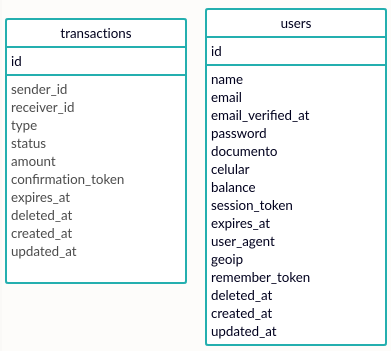
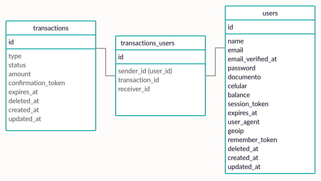

# Test Full-Stack

> Servicio SOAP que se comunica con el front-end a traves de una API REST

### Instalacion:
###### SOAP_service:
* Agrega al .env la configuracion de mailtrap.io y la siguiente key:
 REST_URL=http://{{ url de tu API_api }}/soap/
* Instala dependencia, ejecuta las migraciones e inicia el proyecto
###### API_rest:
* Agrega al .env la siguientes keys:
 SOAP_URL=http://{{ url de tu SOAP_service }}/soap/payco?wsdl
 APP_NAME=Rest_api
 NODE_ENV=development
 PORT=4444
* Instala dependencia e inicia el proyecto con:
``` shell
$ npm run dev
```
###### front-end:
* En caso de ser necesario, modificar la constante REST_ENDPOINT en /src/helpers.js
* Instala dependencia e inicia el proyecto

### Base de Datos:
Los unicos atributos que vale la pena aclarar su concepto son, sender_id y receiver_id en la tabla transactions.
* sender_id es el id del usuario que envia dinero desde su billetera
* receiver_id es el id del usuario que recibe dinero en su billetera
**NOTA**: no se toma en cuenta quien origina la transacion, solo quien envia/recibe dinero


### Endpoints API REST:
###### soap/users/saldo  -  Calcula y actualiza el balance del usuario
* Metodo = POST
* Input: OBJECT = documento: STRING, celular: STRING
* Output: STRING = balance: STRING
* Metodo SOAP = consultaSaldo
###### soap/users/login  -  Inicia sesion y crea session_token
* Metodo = POST
* Input: OBJECT = documento: STRING, password: STRING
* Output OBJECT: STRING = session_token: STRING
* Metodo SOAP = login
###### soap/users/logout  -  Cierra sesion e invalida session_token
* Metodo = POST
* Input: OBJECT = session_token: STRING
* Output = empty
* Metodo SOAP = logout
###### soap/users  -  Registra un nuevo usuario en la plataforma
* Metodo = POST
* Input: OBJECT = name: STRING, documento: STRING, password: STRING, email: STRING, celular: STRING
* Output = empty
* Metodo SOAP = registroCliente
###### soap/listar-usuarios  -  Lista los usuarios disponibles para recibir solicitudes de pago
* Metodo = POST
* Input: OBJECT = session_token: STRING
* Output = users: STRING
* Metodo SOAP = listarUsuarios
###### soap/recarga  -  Recarga saldo a la billetera. Ingreso de la plaforma
* Metodo = POST
* Input: OBJECT = documento: STRING, celular: STRING, amount: NUMBER
* Output = empty
* Metodo SOAP = recargaBilletera
###### soap/pago  -  Solicita un pago a otro usuario registrado
* Metodo = POST
* Input: OBJECT = sender_id: STRING, session_token: STRING, amount: NUMBER
* Output = empty
* Metodo SOAP = solicitaPago
###### soap/correo-confirmacion  -  Envia correo para la aprobacion de una transaccion
* Metodo = POST
* Input: OBJECT = transaction_id: STRING, session_token: STRING
* Output = empty
* Metodo SOAP = enviaCorreoConfirmacion
###### soap/confirma-pago  -  Aprueba la transaccion indicada
* Metodo = POST
* Input: OBJECT = transaction_id: STRING, confirmation_token: STRING, session_token: STRING
* Output = empty
* Metodo SOAP = confirmaPago
###### soap/listar-pendientes  -  Lista las transacciones pendientes del usuario recibido en el input
* Metodo = POST
* Input: OBJECT = session_token: STRING
* Output = pending_transactions: STRING
* Metodo SOAP = listarTransaccionesPendientes

### Observaciones:
* Intente organizar de mejor manera el Servicio SOAP pero me dio problemas al pasarlo a un controlador. Para cumplir con el plazo establecido, lo deje todo en routes/web.php (no estoy para nada orgulloso de eso).
* Tuve problemas al implementar el paquete tymon\jwt-auth en el servicio SOAP, por lo que tuve que manejar la autenticacion y autorizacion con un token sencillo de 8 digitos. (Sin refresh, blacklisting ni demas consideraciones descritas en [mi modelo de autenticacion preferido](https://github.com/rzlams/nodeAuthModule)).
* Solo use queries a las entidades User y Transaction por separado. Las relaciones propuestas para una BD con relacion Many to Many estan comentadas en sus respectivos modelos de Laravel.
* El cliente HTTP que uso es insomnia y tengo entendido que para exportar las colecciones hay que hacer un proceso adicional (no se exactamente cual es). Si necesitan la coleccion no tengo problema en hacercelas llegar.
* El modelo de BD propuesto para aplicar esas relaciones seria el siguiente:

